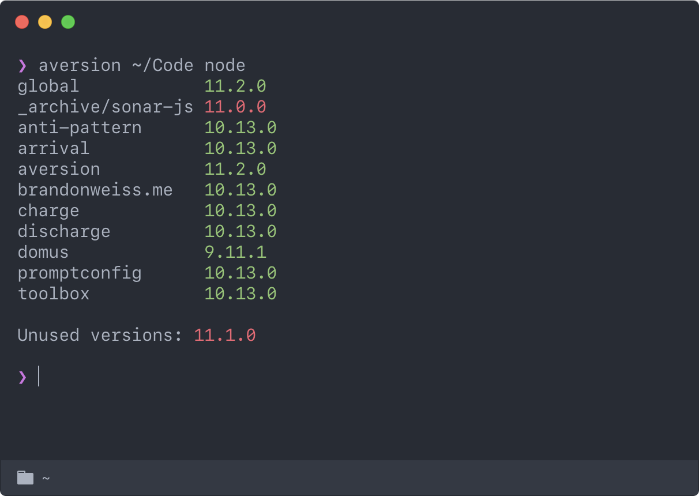

<h1 align="center">
  <br>
  
  <br>
  <br>
  Aversion
  <br>
  <br>
</h1>

[](https://www.npmjs.com/package/aversion)

[](https://david-dm.org/brandonweiss/aversion)


### What?

Aversion helps you manage language versions by looking at which language versions your projects use, which you have installed, and then tells you which you need to install and which you can uninstall. It also gives you an overview of every project and what language version each one is using to make upgrading them easier.

### Why?

Language version managers are great at easily installing new language versions. You can see what language versions you have installed but they don’t know anything about your projects or which language versions each project is using.

Upgrading the versions of a language your projects use happens unevenly. Over time you wind up with a bunch of projects each using a different, possibly outdated language version and a bunch of even older language versions that no project is using and could be uninstalled.

Figuring out which projects are on old language versions and need to be upgraded and which language versions can be uninstalled is tedious, and the more projects you have the more tedious it is.

Aversion is the bridge between your language version managers and your projects.

<div align="center">
  

  <br>
  <br>

  In this example `11.0.0` is in use by a project but not installed, so you know to install it, and `11.1.0` is not in use by any project, so you know to uninstall it.
</div>


## Installation

Install it globally:

```
❯ npm install --global aversion
```

Or using Yarn:

```
❯ yarn global add aversion
```

## Usage

```
❯ aversion <code directory> <language>
```

The first argument is the directory you keep all your programming projects in, like `~/Code` or `~/dev`.

The second argument is the language you want to check, like `node` or `ruby`.

```
❯ aversion ~/Code node
```

If you think you’ll be running this frequently it might make sense to alias the first part of the command.

```shell
alias av="aversion ~/Code"
```

Then you can just run `av node`.

## Languages

Aversion supports multiple languages and multiple version managers for each language.

### Ruby

* [asdf][asdf]
* [rbenv][rbenv]

### Node

* [asdf][asdf]
* [nodenv][nodenv]
* [nvm][nvm]

### Others

Adding more languages and version managers is really easy and pull requests are very welcome!

A version manager definition looks something like this:

```javascript
export default class RBENV extends VersionManager {
  get languageKey() {
    return "ruby"
  }

  get globalVersionCommand() {
    return "rbenv global"
  }

  get installedVersionsCommand() {
    return "rbenv versions --bare"
  }

  get isInstalledCommand() {
    return "which rbenv"
  }

  get projectVersionFiles() {
    return {
      ".ruby-version": (contents: string) => contents.replace("ruby-", ""),
    }
  }
}
```

**languageKey**

The key of the language the version manager manages. This is the language you call `aversion` with, e.g. `aversion ~/Code ruby`.

**globalVersionCommand**

A Bash command that returns the language version used globally (the language version used when *not* in a directory with a local, project-specific language version).

**isInstalledCommand**

A Bash command that exits successfully if the version manager is installed and exits unsuccessfully if it is not installed.

**installedVersionsCommand**

A Bash command that lists the currently installed versions of the language.

**projectVersionFiles**

An object where each key is a string representing the name of the file containing the project-specific language version, and the value is a function that is run on the contents of that file in order to extract the actual version number.

Most version managers will only have one file it looks for in each project, but some version managers support multiple file names.

If no work is necessary to extract the version number you can provide a no-op function: `(contents) => contents`.

## Contributing

Bug reports and pull requests are welcome on GitHub at [https://github.com/brandonweiss/aversion](https://github.com/brandonweiss/aversion).

## License

The package is available as open source under the terms of the [MIT License](http://opensource.org/licenses/MIT).

[asdf]: https://github.com/asdf-vm/asdf
[nodenv]: https://github.com/nodenv/nodenv
[nvm]: https://github.com/creationix/nvm
[rbenv]: https://github.com/rbenv/rbenv
